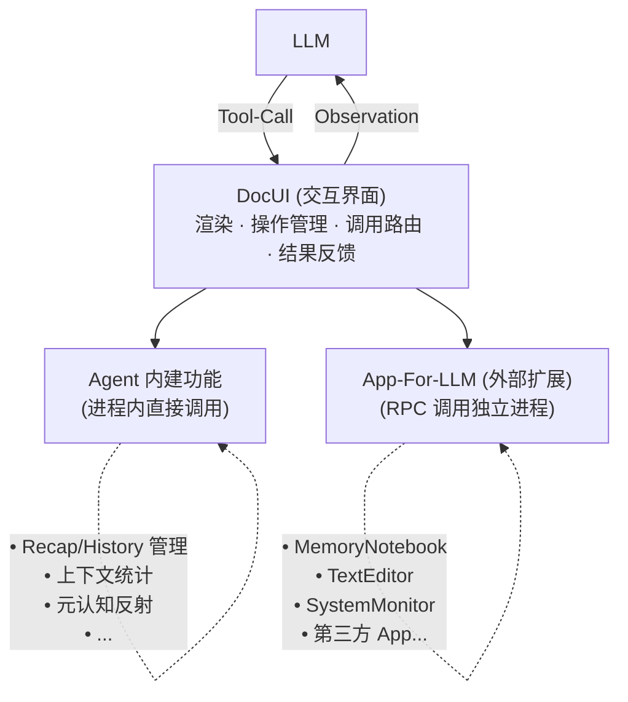

## App-For-LLM
- 是一种Agent系统的扩展机制，把关系紧密的一组数据、视图、操作封装为一个整体供LLM使用。
- 与LLM之间进行双向交互的界面叫做DocUI，包括渲染与操作两个方向。
- 在DocUI语境下简称App。

---

## DocUI 与 App-For-LLM 的分离

### 概念澄清

**DocUI** 是 LLM 与功能交互的**界面层**：
- 渲染信息（将状态呈现为 LLM 可理解的文本）
- 管理可用操作（根据上下文动态调整 Tool 列表）
- 执行功能调用（接收 LLM 的 Tool-Call，路由到实现）
- 反馈执行结果（将结果渲染为 Observation）

**App-For-LLM** 是**外部扩展机制**：
- 独立进程，通过 RPC（PipeMux/JSON-RPC）与 Agent 通信
- 为 Agent 提供额外能力（文本编辑、知识库、外部服务接入等）
- 第三方开发者（包括 LLM Agent 自身）可贡献 App

### 分层架构

> **绘图偏好**: 优先使用 Mermaid，其次 ASCII art。

### 设计原则

1. **界面统一**：无论功能来自内建还是外部扩展，LLM 看到的都是 DocUI 渲染的文本 + 可用的 Tool 列表。LLM 不需要区分功能的实现位置。

2. **内建功能是"器官"，不是"插件"**：Recap、上下文统计等自省功能是 Agent 的内在能力，与 Agent 生命周期绑定。它们直接访问 Agent 内部状态（History、Context），无需 RPC 序列化。

3. **外部扩展走 RPC**：App-For-LLM 一律是独立进程。这提供了进程级隔离（崩溃不影响 Agent）、语言无关性（任意语言实现）、热重载能力（更新 App 无需重启 Agent）。

4. **不提供内嵌插件机制**：避免"内嵌 vs 外部"的边界模糊。内建功能是 Agent 开发者维护的核心能力；外部扩展是第三方贡献的附加能力。

### 决策记录

> **2025-12-12 架构讨论**
> 
> 原先将 DocUI 与 App-For-LLM 绑定，导致"自省功能是否需要内嵌 App"的两难。
> 
> 分离后：
> - DocUI 是交互界面，与实现位置无关
> - Agent 内建功能直接通过 DocUI 暴露，不是 App
> - App-For-LLM 专指外部进程扩展
> 
> 参见：`agent-team/meeting/2025-12-12-app-process-architecture.md`

## TODO
需要为使用DocUI的两类实体制定不同的命名，或者统一的接口名。
