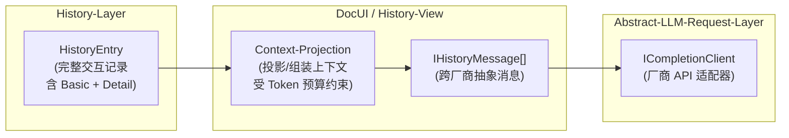
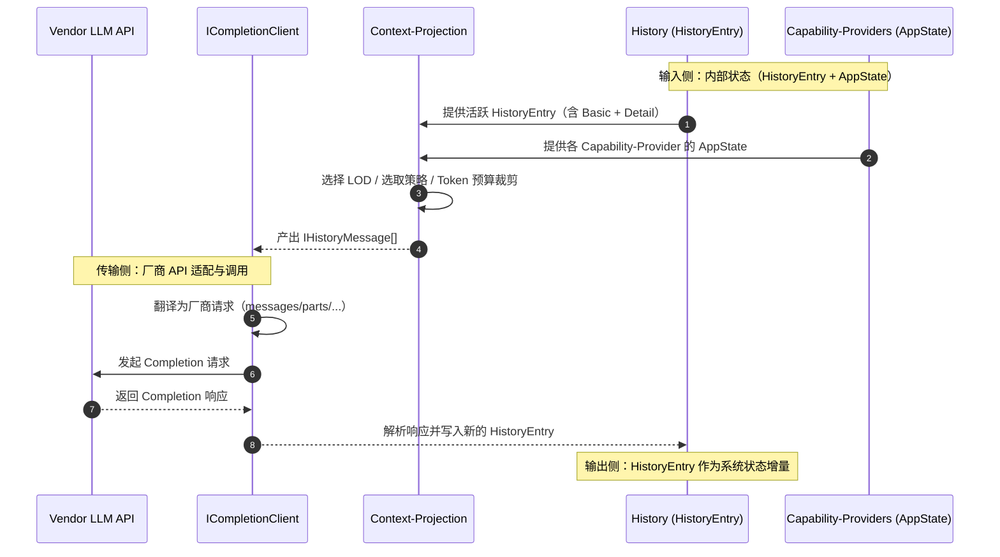

使用 Reinforcement-Learning 概念体系，近期也务实的使用Chat范式的常规LLM。

## 借用心理学术语
我们构造的是智能系统，关心的是系统的外在行为与内在行为，追求模拟人类等自然智能系统的有益心理机制，既然是模拟就会借用前人的心智模型研究成果。后续所有涉及心智模型的术语借用皆指等效模拟机制和行为层面，而忽视技术实现是生化反应还是计算机建模。

---

## 术语与概念定义

### Environment

> **Environment** 是 Agent 系统中的外部状态转移函数。

Environment 包含 Agent 所能感知和影响的一切外部实体：文件系统、网络服务、数据库、其他 Agent、人类用户等。Agent 通过 Agent-OS 中介与 Environment 交互。

### Agent

> **Agent** 是一个能感知环境、为达成目标而行动、并承担行动后果的计算实体。

Agent 系统有内部和外部两个状态转移函数，交替发挥作用：
- **内部状态转移函数**: LLM（根据 Observation 生成 Action）
- **外部状态转移函数**: Environment（根据 Action 产生新状态）

### Agent-OS

> **Agent-OS** 是 LLM 与 Environment 之间进行交互的中间件。

Agent-OS 的核心职责：
- 向 LLM 提供对 Environment 的 Observation
- 尝试执行 LLM 发出的 Tool-Call
- 管理 Agent-History（记录、维护、Context-Projection）

### LLM

> **LLM** (Large Language Model) 是 Agent 系统中的内部状态转移函数。

具体指 Causal Generative Pre-Trained Large Language Model。典型情况下是 Autoregressive 模型，但也可以是逐块输出的 Diffusion 模型（可认为是用扩散方法一次生成一批 Token 的自回归模型）。

### Observation

> **Observation** 是由 Agent-OS 发送给 LLM 的 Message。

Observation 呈现 Agent-OS 向 LLM 展示的部分重要系统状态，包括：
- Tool-Call 的执行结果
- Environment 中的事件通知
- 各 Capability-Provider 的状态快照

### Action

> **Action** 是由 LLM 发送给 Agent-OS 的 Message，由 Thinking 和 Tool-Call 两部分组成。

Action = Thinking + Tool-Call。Agent-OS 仅解析 Tool-Call 部分，Thinking 部分对 Agent-OS 无语义效力，但对 LLM 自身推理至关重要。

### Tool-Call

> **Tool-Call** 是由 LLM 发出的、由 Agent-OS 负责尝试执行的同步功能调用。

Tool-Call 是 LLM 影响 Environment 的唯一方式。每个 Tool-Call 包含：
- 工具名称
- 调用参数
- （执行后）调用结果

### Thinking

> **Thinking** 是 Action 中非 Tool-Call 的部分，体现 LLM 的 Chain-of-Thought 推理过程。

Thinking 是 Agent 系统的**重要内部状态**——它直接影响 LLM 后续 token 的生成概率分布，是推理能力的核心机制。Agent-OS 不解析 Thinking，但会将其记录在 Agent-History 中。

### Agent-History

> **Agent-History** 是 Agent 系统状态的一部分，由 Agent-OS 负责记录、管理、维护。

Agent-History 的特性：
- **增量**: 随每次 LLM 调用增长
- **仅追加**: 新条目只能追加，不修改已有条目
- **不可变**: 已记录的条目不可更改

### HistoryEntry

> **HistoryEntry** 是 Agent-History 中的单条记录，包含丰富且相对完整的 LLM 交互信息。

HistoryEntry 与 IHistoryMessage 的关键区别：HistoryEntry 中存储的 ToolCallResult 包含 **Basic + Detail 两个 LOD 级别**的信息，而 IHistoryMessage 仅包含 LOD 选择后的一份信息。

目前代码在 `atelia/prototypes/Agent.Core/History/HistoryEntry.cs`。

### History-View

> **History-View** 是由 Agent-OS 通过 Context-Projection 渲染的、用于向 LLM 展示的 Agent-History 部分信息。

History-View 是 Agent-History 的投影结果，受 Token 预算约束和 Attention Focus 影响。

### Message

> **Message** 是 LLM 与 Agent-OS 之间的一次单向信息传递（分块通讯模型）。

设计选择：
- 采用**分块通讯模型**而非流式通讯
- LLM 与 Agent-OS 之间采用 **Half-Duplex** 方式通讯
- 对应当前主流 LLM 批量 Pre-Fill + 批量 Decode 的架构特性

---

## 明确弃用的概念

### ~~Human-User~~ (Deprecated)

> **Human-User** 是 Chat 范式中的唯一用户概念，在 Agent 系统中**已弃用**。

弃用理由：Agent 系统不是一对一问答服务。LLM 通过 Agent-OS 与 Environment 互动，Agent 可能和形形色色各种关系的人群交互。Chat 范式中的 User 角色被 Agent-OS 取代。

### ~~To-User-Response~~ (Deprecated)

> **To-User-Response** 是 Chat 范式中 LLM 直接向用户回复的概念，在 Agent 系统中**已弃用**。

弃用理由：Agent-OS 只解析 Action Message 中的 Tool-Call 部分，其他 LLM 输出不触发 Agent-OS 的状态转移。LLM 有向 Environment 中的其他人或 Agent 说话的需求时，需要采用 Tool-Call 的方式。这与编程语言中将 print 从关键字变为库函数的演化过程相似。

---

## 重要澄清

### 关于 Thinking/CoT

Agent-OS 不解析 Thinking 部分，并不意味着它是无用的或仅供调试。Thinking 是 Chain-of-Thought，是 Agent 系统的**重要内部状态**——它直接影响 LLM 后续 token 的生成概率分布，是推理能力的核心机制。Thinking 对 Agent-OS 无语义效力，但对 LLM 自身至关重要。

### 关于分块消息与流式传输

这是不同层面的概念，不要混淆：

- **当前 LLM 的分块特性**: 典型 LLM 采用批量 Pre-Fill 再批量 Decode 的架构，模型的输入输出在语义层面是分块的。这些块状信息是否采用流式传输（如 SSE）是传输层的实现细节。
- **真正的流式 LLM**: 是 "Think while Listening" 的全双工架构。最简形式是每输入一个 token 都输出一个 token，外界输入流和自身输出流共同构成模型上下文。技术上可通过位置编码区间划分或 Channel 编码实现。这种架构支持语音交互中的抢答与插话。
- **本文档采用分块消息模型**，对应当前主流 LLM 的实际能力。

---

## LLM 调用的 3 层模型

| 层次 | 接口/类型 | 职责 |
|------|----------|------|
| **History-Layer** | HistoryEntry | 丰富完整的 LLM 交互记录，含 Basic + Detail 两级 LOD |
| **DocUI-Layer** | IHistoryMessage | 抽象的跨厂商 LLM 调用接口，LOD 选择后的单一版本 |
| **Completion-Layer** | ICompletionClient | 各厂商规范的具体 API 适配实现 |

**ICompletionClient**: 每种厂商规范有独立的实现，包括但不限于 OpenAI v1、OpenAI Responses、Anthropic Messages v1、Gemini Content Parts 等。目前仅有 `atelia/prototypes/Completion/Anthropic` 一份实现，后续继续补充其他厂商和规范。由 Abstract-LLM-Request-Layer 翻译得到。

**IHistoryMessage**: 抽象的跨 LLM 厂商和规范的 LLM 调用和结果。目前代码在 `atelia/prototypes/Completion.Abstractions`。由 History-Layer 渲染得到。ToolCallResult 仅包含 LOD 渲染后的一份信息。在最后一条 Observation 中包含渲染出的各 App-For-LLM 的信息，也就是 DocUI 的渲染结果。

**HistoryEntry**: 丰富和相对完整的 LLM 交互记录。目前代码在 `atelia/prototypes/Agent.Core/History/HistoryEntry.cs`。随着每次 LLM 的输入和输出创建。与 IHistoryMessage 的一个重要区别是 HistoryEntry 中存储的 ToolCallResult 包含 Basic + Detail 两个 LOD 级别的信息。

### 图 1：三层模型结构视图

### 图 2：调用序列图（完整数据流）

### Context-Projection

> **Context-Projection** 是由活跃 HistoryEntry 和 AppState 生成用于 LLM 调用的一组 IHistoryMessage 的过程。

**弃用术语**: ~~Render~~（过于宽泛，易与前端 UI 渲染概念混淆）

**输入/输出契约**:
- **输入**: 
  - 活跃 HistoryEntry 集合（包含 Basic + Detail 两级 LOD 信息）
  - 各 Capability-Provider 的 AppState
  - Token 预算约束
  - 当前 Attention Focus（决定 LOD 选择）
- **输出**: 
  - IHistoryMessage[] 序列（用于构建 LLM 请求上下文）
  - 实际 token 消耗估算

**过程语义**: Context-Projection 是一种"投影"操作——从丰富的内部状态（HistoryEntry + AppState）投影到受限的上下文窗口（IHistoryMessage[]）。这一命名借鉴自 Event Sourcing 领域的 Projection 概念。

## TODO
- 关于ICompletionClient，需要查找和确定更准确的各厂商API规范名称。
- 关于由活跃HistoryEntry和AppState生成用于LLM调用的一组IHistoryMessage的过程，用Render这一名称虽然通俗易懂但是过于宽泛，争取找到更好的术语表述此过程。
- 关于LLM调用的3层模型，需要更好的命名。需要一份Mermaid插图。
- 关于HistoryEntry层和IHistoryMessage层，可能各需要一份Mermaid插图展现信息的结构。
- 关于IHistoryMessage，考虑是否改名回“IContextMessage”，考虑是否从接口改为类型。
